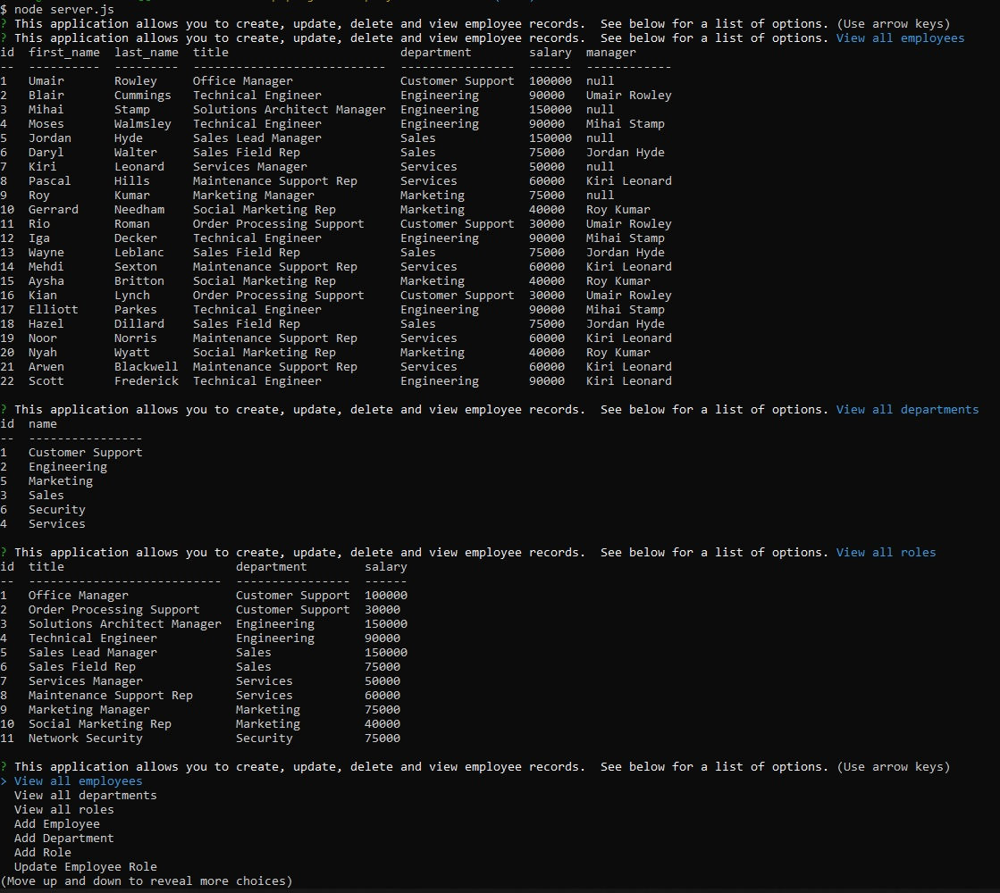
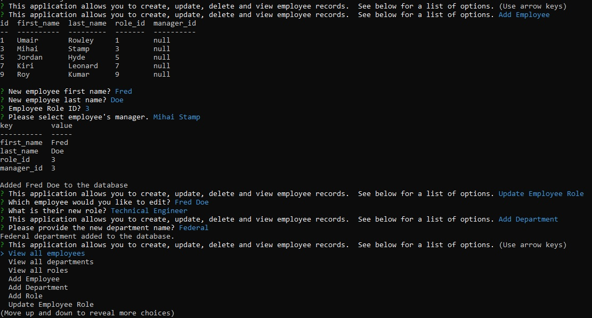

# Employee Tracker (Challenge 12)
 
 -------------------------------
## Description 
  The Employee Tracker application is a businesses node based CLI tool that provides a clean efficient method for organizing, tracking, viewing, adding and updating employee records using the mySQL database.

## Table of Contents:
  * [Installation](#installation)
  * [Usage](#usage)
  * [License](#license)
  * [Contributing](#contributing)
  * [Tests](#tests)
  * [Questions](#questions)
 --------------------------------- 
## Installation
To run this application, the user will need to download the following:

A code editor like VSCode to customize and update code
node.js
mySQL (optional Workbench)
npm Inquirer module
npm Express module
npm mysql2 module
npm dontenv module
npm console.table module
CLI Terminal like Bash

## Usage
 * To use app the user will need to do the following:
  - Clone GitHub repository (link below)
  - Open folder in a code editor
  - Run npm i to install required dependicies
  - Update env file with personal mySQL credentials
  - Create database and tables by entering the mySQL CLI and running <source db/schema.sql>
  - If user wants dummy data, then seed the table by running <source db/seeds.sql>
  - Navigate to the root EMPLOYEE-TRACKER-12 folder in the CLI and run <node server.js>
  - Questions will then be presented to the user in the CLI with options for viewing, adding, and updating employee records.

## License Details:
 [Link to MIT License Details](https://choosealicense.com/licenses/mit/)

## Tests
  No testing done

## Contributing
  * Scott Nichols
  * Consulted with Sabriel Gee (fellow student)

 ---------------------------------
### Questions
* Github Repo: https://github.com/Sessions21/employee-tracker-12
* Walkthrough Video Link:
* Contact me with questions: s21nichols@hotmail.com

### Example CLI Output:
 

